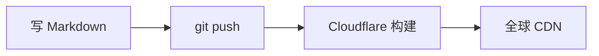

每次隔一段时间不写，就会忘记 front-matter 里某个字段到底叫 `cover` 还是 `top_img`。所以干脆写成一篇速查表，忘了就翻自己博客。

<!-- more -->

## 新建一篇文章

```bash
npx hexo new "文章标题"        # 生成 source/_posts/文章标题.md
npx hexo new draft "草稿标题"  # 生成草稿，不参与构建
npx hexo new page "about"     # 生成独立页面 source/about/index.md
npx hexo publish "草稿标题"    # 草稿转为正式文章
```

> 文件名**建议用英文 slug**，`title` 再写中文。否则文章 URL 会变成一长串百分号编码，既难看又不好分享。

## front-matter 速查

写在 Markdown 文件最上方，两行 `---` 之间：

| 字段 | 作用 | 示例 |
| --- | --- | --- |
| `title` | 文章标题 | `title: 你好，世界` |
| `date` | 发布日期，决定排序 | `2026-10-03 21:40:00` |
| `updated` | 最后修改时间 | 不写则用文件修改时间 |
| `tags` | 标签，可多个 | `[Hexo, 教程]` 或分行 `- Hexo` |
| `categories` | 分类，**只建议写一个** | `[折腾记录]` |
| `description` | 摘要，用于首页和 SEO | 一句话概括 |
| `keywords` | SEO 关键词 | `Hexo,博客` |
| `cover` | 本文封面图 | `/img/cover-1.svg` |
| `sticky` | 置顶（数字越大越靠前）。⚠️ **不是 `top`** —— 写 `top` 不生效且不报错 | `100` |
| `toc` | 是否显示目录 | `true` / `false` |
| `comments` | 是否开启评论 | `true` / `false` |
| `mathjax` | 本文是否需要数学公式 | `true` |

**关于 `categories`**：Hexo 的分类是「层级树」，写两个以上会变成父子分类而不是并列标签。要多维度归类，用 `tags`。

## 摘要与目录

在正文里插入 `<!-- more -->`，它之前的内容就是首页摘要：

```markdown
这里是摘要，会显示在首页卡片上。

<!-- more -->

这里是正文剩余部分。
```

目录（TOC）由主题自动生成，不需要手写。前提是 front-matter 里 `toc: true`，而且正文用了 `##`、`###` 这样的标题层级。

## Butterfly 标签插件

这些是主题提供的富文本组件，语法是 Hexo 标签插件，**在 Markdown 里直接写就行**。

### 提示框 note

先看效果：


这是一条 `info` 提示。适合放补充说明。



这是一条 `warning` 警告。适合放「这里容易踩坑」。



这是一条 `danger` 危险提示。适合放「千万别这么干」。


写法（可用的语义色：`default` `primary` `success` `info` `warning` `danger`）：


```markdown

这是一条 info 提示。



这是一条 warning 警告。

```


也可以只写一行，或者加上图标：


```markdown
单行也能用
带一个灯泡图标
```


### 选项卡 tabs

适合展示「同一件事的多种做法」：


<!-- tab 命令行 -->
用命令行创建：

```bash
npx hexo new "文章标题"
```
<!-- endtab -->

<!-- tab 手动创建 -->
直接在 `source/_posts/` 目录里新建一个 `.md` 文件，然后把 front-matter 补上。
<!-- endtab -->


写法：


```markdown

<!-- tab 标签一 -->
内容一
<!-- endtab -->

<!-- tab 标签二 -->
内容二
<!-- endtab -->

```


`<!-- tab 标题@fas fa-code -->` 这样写还能给标签加图标（`@` 后面跟图标类名）。

### 标签与按钮

行内标签：    

按钮：

写法是**逗号分隔**，顺序为「链接, 文字, 图标, 样式」：


```markdown


```


### 其他插件一览

| 插件 | 写法 | 用途 |
| --- | --- | --- |
| `hideToggle` | `` … `` | 折叠内容 |
| `inlineImg` | `` | 行内小图 |
| `gallery` | `` 内含 Markdown 图片 `` | 图片画廊 |
| `timeline` | `` 内含 `<!-- timeline 时间 -->` | 时间轴 |
| `series` | `` | 同系列文章列表 |
| `score` | `` | 评分条 |
| `mermaid` | 见下 | 流程图 |

> 上面表格里的 `` 只是示意写法，实际使用时不要加反斜杠或转义，直接原样写。

## 图片

推荐用**文章资源文件夹**：`_config.yml` 里 `post_asset_folder: true` 已开启，所以每篇新文章会自动带上一个同名文件夹。

```bash
npx hexo new "my-post"
# 生成：
#   source/_posts/my-post.md
#   source/_posts/my-post/       <-- 图片丢这里
```

然后这样引用（用标签插件，路径不用写全）：


```markdown

```


想用标准 Markdown 语法就写相对路径：

```markdown

```

**注意**：`post_asset_folder` 会让图片路径变复杂，如果你更习惯「所有图片丢一个公共目录」，把 `_config.yml` 里的 `post_asset_folder` 改成 `false`，图片统一放 `source/img/`，然后引用 `/img/xxx.png`。

## Mermaid 流程图

主题内置了 mermaid，但默认关闭。要用的话先在 `_config.butterfly.yml` 里打开：

```yaml
mermaid:
  enable: true
  code_write: true
```

然后写：


````markdown

````


## 本地预览与发布

```bash
npm run server     # 本地预览 http://localhost:4000，改完自动刷新
npm run build      # 生成静态文件到 public/
git add . && git commit -m "post: 文章标题" && git push
```

推上去之后 Cloudflare Pages 会自动重新构建，一两分钟后线上就是最新的。

---

**一个小建议**：不要攒着「等写完美了再发」。博客的价值在于持续记录，一篇 300 字的踩坑笔记，半年后可能比一篇精雕细琢的长文更有用。
